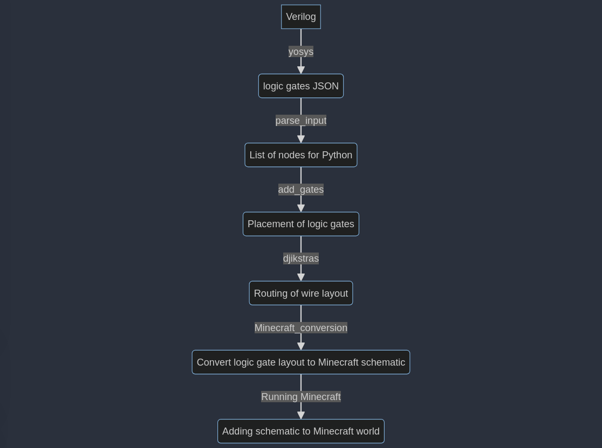

# HackNotts

## Description/Background
This project was developed by the three of us in 24 hours for [HackNotts '84](https://www.hacknotts.com), a hackathon hosted by the Univeristy of Nottingham.
The aim of this project was to convert [Verilog](https://en.wikipedia.org/wiki/Verilog) HDL files into a schematic which can be pasted into the game Minecraft and was proposed by one of the three of us, Matthew. Something important to us was ensuring that the project used blocks only available in Vanilla Minecraft so anyone could use it without mods (excluding World Edit which is required to paste the schematic into the world).

Verilog HDL was chosen as it is widely used in the semiconductor industry for designing FPGAs to make the program as widely useable as possible. Additionally, it allows us to theoretically use any Verilog file, including those which design entire computer chips, and automatically convert it into Minecraft redstone.

In short, through the use of Verilog, Yosys, Python and World Edit, we succeeded. However, there are limitations and issues with our current solution (as expected when given a 24 hour deadline) which are detailed below. 

### Inspiration
Our inspiration for this project comes from [here](https://github.com/itsFrank/MinecraftHDL). This is a similar project which can process combinatorial logic circuits from HDL, however, we aimed to surpass this by including sequential logic in our solution as well.

### Result
This is the [devpost](https://devpost.com/software/hdl-to-minecraft) submitted as part of the HackNotts submission which features a video and pictures of a successful 2-bit counter, generated solely from Verilog and then run through our program and put into Minecraft.

[This video](./PXL_20231105_142550781.TS.mp4) also shows our successful 3-bit counter (also generated purely from the program) which is the most complex circuit we have generated so far, as well as the graveyard of learning experiences (AKA failed attempts).

We are all incredibly proud of our accomplishment. This was a very ambitious project which none of us thought we would complete in time, we just wanted to go and have fun coding something for a day. We are also honoured by the interest which others showed this project throughout the event which truly shows that pulling an all-nighter was worth it.  

For this project, we won the "Hackiest Hack" prize, due to the ambition and complexity behind the project, as well as the very hack-y `while True: random.shuffle` when laying out the initial gate positions.

## Detailed Description

This is the flowchart which shows how to use our program. It shows how you must first create the Verilog HDL file and run yosys to convert it into a JSON file readable by our code. If you then want to use our program, you should run [minecraft conversion.py](./minecraft%20conversion.py) which does the steps after creating the JSON and then you need to copy the schematic file (.schem) from the directory in which you run [minecraft conversion.py](./minecraft%20conversion.py) and copy it into your Minecraft schematics directory, which you can then use to paste it into the world by using World Edit.

### Technology Used
#### Yosys

[Yosys](https://yosyshq.net/yosys/#:~:text=Yosys%20is%20a%20framework%20for,algorithms%20for%20various%20application%20domains.) is a framework which allows for Verilog RTL synthesis. We use this to take the Verilog file and convert it into a JSON formatted net-list which [parse_input.py](./parse_input.py) can handle and convert into useful information for the rest of the program. 

#### McSchematic
This is a Python library which allows us to build the schematic file which can then be pasted into the world.

### Overview
- [parse_input.py](./parse_input.py) is used to parse the JSON file into a suitable Python representation
- [routing.py](./routing.py) is used to lay out the logic gates and connect the "wires" to each other.
- [minecraft conversion.py](./minecraft%20conversion.py) is used to generate the Minecraft schematic using the result from `routing.py`
- [classes.py](./classes.py) holds the classes for Node, Input and Output classes, all of which are used when routing.
- [constants.py](./constants.py) holds *some* of the symbolic constants used in this project. Some of the constants are also in `routing.py` but we were tired and on a time constraint so give us a break.
- [gates.py](./gates.py) allows us to easily represent logic gates as well as determine where their inputs and output should be. Since we knew we were only going to represent gates with one output, we only allow for one output signal however, this could be easily scaled in the future, for example if you want to cluster gates together which may give multiple outputs.

Our code takes the parses the JSON file and takes all of the inputs, outputs and logic gates while assigning a unique identifier to the output wires and input wires for each gate which allows for easier routing later on.
We take these logic gates, inputs and outputs and arrange them (the logic gates) randomly on a roughly N x N grid, each separated by `GAP` blocks. This is stored in the 3-dimensional array `blocks` in [routing.py](./routing.py). We used this 3-D array representation because it allows for easy translation into Minecraft.
The inputs and outputs are always spread as evenly as possible accross the opposite far ends of the top layer and the logic gates are randomly spread in between, in the grid like manner previously mentioned. The first layer of the `blocks` array stores this information. A limitation of our placement is that we assume the logic gate fits in a 3x4 space. This can easily be ammended if it doesn't but all of our gate implementations do so we just have that as an assumption.

The second layer of the `blocks` array is the first routing layer. This intially is populated with the gate input and output locations.
The third layer is another routing layer, used so that wires can go underneath each other.

The code then goes through each wire in turn, performing Dijkstra's shortest path algorithm to find the shortest route from the wire's start position to each of the end positions (one wire may connect to multiple gates).
After finding the optimal route between the start and end positions, we backtrack from the end positions and populate the `blocks` array with `REDSTONE`. If we then have to go down or up a layer, we mark the position as a `VIA_UP` or `VIA_DOWN` respectively.
A pre-processing step which is required for the Dijkstra's to work properly is to mark the `visited` array as visited for any unrelated gate input or gate output so that a wire doesn't go through a different gate and we also have to mark any redstone as visited since wires can't cross. When marking each of these, we also have to mark the surrounding 8 positions on the same layer (the 8 direct neighbours) since the redstone wires may interfere with each other.

After connecting every wire we then go through the array to make sure that there aren't two wires of different types touching because this can cause interference. Additionally, due to edge cases within the code and limitations of Minecraft, we have to go through the array and make sure that each `GATE_INPUT` and `VIA_UP` has at most 1 redstone cardinal neighbour. This is because the redstone cannot flow through the block used when placing the `VIA_UP`, which it would have to do if we wanted to allow for this.

We then go back through the array and make sure that the strengths of the wires are okay. Redstone has a limit of 15 blocks that it can travel without losing signal, so we go through each wire and backtrack from the end, placing a redstone repeater where possible in order to boost the signal strength. An important note is that repeaters must be placed on straight lines to work properly (it must replace the middle block of 3 redstone in a line), which caused a lot of issues with the placement as we had to make sure the repeater isn't placed on a zig-zag. We decreased the chance of this happening by favouring straight lines when backtracking from the result of Dijkstras. If a repeater can't be placed within 15 blocks then this circuit can never run and this layout is impossible.

We then use this array to place the blocks in Minecraft. The basic idea of this is quite simple, if you see a logic gate then place all the required block for that logic gate since we know how the gate looks and then do the same for redstone, vias and repeaters. However, there were some difficulties with placing repeaters in the correct direction and chaining vias (our solution to the latter being "disallow them from happening in the first place").

## Difficulties
### Placing the blocks
We had some difficulties when placing the blocks. This wasn't technically challenging but was very time consuming to make sure that each logic gate was correctly placed and oriented correctly.
Another challenge when placing the blocks came in the form of chaining vias. When you have a via going down, it is fairly simple to chain them. You can't have the via down the same way as you have the gate output going down but that isn't a problem because the gate inputs are all on the first routing layer and are labelled differently so its very easy to tell. The issue comes with vias going up. The current design of upwards vias don't allow for chaining due to minecraft's limitations with redstone and redstone torches as well as the layers being 4 blocks vertically apart from each other. This issue would still occur if they were further or closer apart but it may have been able to be cirvumnavigated. Our solution to this was to block the area underneath a via up when performing Dijkstras. This means that nothing can go vertically into a via up which means via ups are never chained.
This does however have the side effect that some circuits which were previously possible became impossible because if you want to go up two layers at once, you now need to take another block of horizontal space to connect to the new via.

### World Edit
An issue we faced with World Edit (the Minecraft mod used to paste the circuits into the game) is that redstone torches are automatically set in the "on" state. This gives them 4 in-game ticks to wreck havoc before the other redstone torches turn it off as it should be. There are two solutions to this, the initial solution we used was to accept that the circuit will be broken and to run the circuit a few times before it catches up with itself and is synchronised. However, we ended up using another solution in the end by turning off any setting which may cause this issue and also changing how the logic gates are generated so that the circuits start in their correct states. This can still cause errors sometimes, in which case the first solution is our fallback.

### Coordinate system
I will easily admit, this was entirely my (Eric's) fault. When creating the `blocks` array, I set it as `blocks[x][y][z]` instead of the expected `blocks[z][y][x]`. This gave us a lot of issues and confusion later into the process, but at that point it was too late to go back and fix it so we were stuck with it. This definitely taught me how important it is to make sure that there is a good foundation to the code and how a small error, done without much thought, can have disastrous effects on the final product. 

Another issue we had is that Minecraft's coordinate system is different as well. Minecraft has `x` and `z` as it's North/East directions and `y` as it's vertical direction, so what we should have done is had the `blocks` array as `blocks[y][z][x]` which would have made the translation into Minecraft even easier.

### Repeaters
As previously mentioned, repeaters must be placed atleast every 15 blocks along the redstone circuit in order for the signal to be strong enough, while avoiding zig-zags.
Redstone must be placed in a configuration like this (`x` is air, `r` is redstone, `R` is repeater)
```
xxx
rRr
xxx
```
And cannot be placed like this.
```
xxx
rRx
xrr
xxx
```

Additionally, repeaters must follow the flow of the wire meaning we had to store the wire's flow direction for each redstone piece.

One efficiency improvement is that currently we place all of the redstone down and keep track of which wire segments are longer than 15 blocks (our implementation of vias also repeat the signal) and then go back through and place the repeaters. Obviously, these two steps can be combined however we did them separately and when trying to do them together got some issues which could be solved given enough time but time was (and is) a finite resource.

### Propagation delay
Minecraft has various forms of delay, including, repeaters, redstone torches and pistons. This creates an issue when trying to synchronise a circuit.
Instead of facing this issue, we made the clock very slow meaning that by the time the next cycle will come around, everything will be finished processing and then we sped up the game speed so that we didn't have to wait for a long time. This is not a proper solution to this issue but it would require much more time and thinking to come up with a better one. 

### Sleep deprivation
This was a constant battle throughout the 24 hours. As time went on, our abilities to code because worse and worse as we got more and more tired. This could easily be solved by taking the 20 minute walk back home and sleeping however none of us regret not doing this. We may have finished with more time remaining to allow for more vanity features, however, by staying up the entire night we got the true hackathon experience and we still managed to complete the project.

## Known Issues and (Possible) Solutions

### No rotation
Currently, the Minecraft schematic is always output in a specific direction. This is just a consequence of the block placements and can't really be fixed, unless we ask the user to input the orientation they want it to be output. 
Theoretically, you could use World Edit's `rotate` function after placing it in the world as a solution to the problem. 

### random.shuffle
The logic gates are initially placed randomly on the grid, however, this can cause times where the circuit becomes impossible to complete, either due to wires crossing, becoming too close or violating any constraints we had with vias. These issues were particularly apparent as we only had two routing layers, making it difficult for the algorithm to find a valid path. When this happened, our solution to start from scratch but with a new, random permutation of the logic gates. This is very inefficient as you can image but anything more complex would have required more time. This also technically means that our program may never find a valid circuit due to the random chance in `random.shuffle`.

This is an NP-Hard problem, however there are two better alternatives to what we currently do. The first is instead of randomly shuffling the logic gates, you go through each permutation of the logic gates instead. This will still be dreadfully inefficient but it would mean that if there is a configuration which works with the constraints of our program, our program will find it. The second solution would be to develop a more complex placement algorithm, for example one using [machine learning](https://arxiv.org/abs/2202.13564).

### Speed
#### Code Limitations
One very large problem is that our code is slow. Very slow. The thing which takes the most time is the routing using Dijsktra's algorithm and a lot of the time is spent restarting when a solution appears which violates one of the constraints (e.g. redstone can't be next to each other). 
We managed to successfully generate a circuit for a 3-bit counter (10 logic gates) in reasonable time (less than 10 minutes) however, we didn't manage to generate a 4-bit counter (16 logic gates) as it took too long to run and was too inconsistent with invalid outputs. A way to increase the chance for invalid outputs is to increase the layer size (more about this later) or to allow for more space between chips. However, allowing more space between chips would increase the overall size of the circuit meaning that dijkstras has more cells to process, slowing down that part of the process.

Our code can be sped up in multiple ways
- Clean up the implementations, removing and combining unneccessary loops.
- Make it so that via ups don't have the previously mentioned limitation. This will decrease the chance of invalid circuits meaning that you restart less often.
- Use a better path finding algorithm than Dijkstras.
- Use a language other than Python for the routing (or maybe even the whole thing). This project doesn't lend itself particularly to Python and may be better suited for C++ which would allow for faster implementations of the algorithms due to pointers.

#### Minecraft Limitations
But it isn't all our fault! Minecraft has some limitations of it's own. Redstone doesn't travel instantly in Minecraft and each repeater adds 1 tick (0.05 seconds) of delay to the circuit. Additionally, redstone torches (used for via ups and the logic gates) require 2 ticks (0.01 second) of delay and pistons (used for via downs) have 3 ticks of delay (0.15 seconds). This adds significant time when summed. Our solution to this was to use the Minecraft mod Carpet to speed up the game so that we could change the tick speed (e.g. 1 tick = 0.025 seconds). 

### Layer Depth
One very large limitation of our current solution is that it is limited to 2 layers of routing. 
This would be quite simple to solve. The routing code will be able to be modified to handle more layers given a small amount of tweaking to ensure that via ups won't chain on any of the other layers and the Minecraft placement code currently uses some hard coded values which will have to be removed and changed in order to allow for multiple layers.

The largest issue with adding more layers would be how much extra time it would take to route the wires, meaning that any circuit will be infeasible given enough layers (due to time constraints) as mentioned in the [#speed] section.

### Minecraft logic gate dimension limitations
Our code currently assumes that logic gates can fit in a 3x4 space and has no easy way to change these values without changing the code. This is because all of our logic gates do fit in that range, so we don't need to spend time and effort implementing something which can do variable sized.

There are two solutions to this, one solution is to not worry about it. Technically, any new logic gate you create can just extend vertically upwards and do more logic up there if needed. All that matters is the inputs and outputs are within a 3x4 horizontal plane. This isn't a very nice solution though. The other solution would be to make it allow for variations in size. A simple way for this is to just find the largest gate and assume everything is that size and deal with it when it is required.

### Gate gap size
A large issue with the code is that the space left between each logic gate is not dynamically changed. This can result in scenarios where you try to build a circuit but it can't find a solution. At one point, we were trying to build a 3-bit counter using our program and a gap size of 5, however we couldn't get a solution. We then increased the gap size to 7 which allowed the circuits more room to breathe which then gave us an output.

As a general rule, if the code is failing due to the redstone circuits error (`AssertionError("Redstone too close together and clashing")`), increasing the gap between logic gates is probably the best thing to try initially.

### Bugs
As with all code, it isn't flawless and there are some bugs which happen for reasons we aren't really sure about and haven't had enough time to debug and fix.
These include (but are no limited to)
- Not enough repeaters being placed
- Redstone overwriting gate input and outputs
- Redstone going through up vias (even though we say it can't)
- Getting stuck in an infinite loop
- Index out of bounds errors due to the program trying to route a wire from empty space.


## Conclusion
In conclusion, we made a program which (some of the time) successfully can convert Verilog HDL files into Minecraft redstone using very limited in-game modifications in only 24 hours.

We are very happy with the result of this project. It was very ambitious and we managed to complete it just within the time limit, showing it was in fact the perfect size for our skill level. We made a lot of mistakes along the way when coding this project (if someone wants to extend it I would recommend starting from scratch, it might be easier) and learnt a lot from it (especially Eric).

Although the project has a lot of bugs and issues and only works 50% of the time, it has a special place in each of our hearts.
