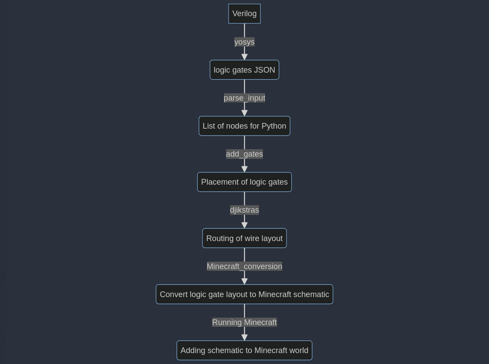

# HackNotts
Inspiration taken from [this project](https://github.com/itsFrank/MinecraftHDL).

Components:

## yosys
The yosys library converts a given verilog logic gate file into an equivalent JSON file using the defined logic gates in the mycells.v and mycells.lib files.

## Parse Input
This file is where we take the input from the verilog file conversion to the JSON files and output them as a predefined gates with nested lists of inputs and outputs.

## Constants
This is where we define the types of blocks required for our logic gates along with the names of the logic gates.

## Classes
This is where we define the node (logic gates), output and input classes and define the class variables.

## Gates
This is a dictionary defining the inputs and outputs of the logic gates defined in the constants class.

## Routing

This file has two parts to it in order to produce a 3d array of gate locations and wire routing between them.

### Placement
The add_gates function places the inputs, outputs and logic gates spaced out onto the array in a way that makes it easier to route wires around. This includes at least 1 space between inputs/outputs and 5 spaces between logic gates and other components.

### Wire Routing
The dijkstras function uses Dijkstra's algorithm to route the wires on the 3d array created in the placement stage. Due to the properties of Minecraft redstone, a gap of at least 1 must be kept between redstone wires. A block type of 1 indicates a via point, which indicates that a wire must go down or up a layer to continue the connection (this is to help with the minecraft conversion where the via up and via down are 2 distinct components to simplify things).

## Minecraft Routing
Using mcschematic, we take the output from the routing function and convert the array to the corresponding logic circuit using Minecraft redstone. This is done by checking the value of the block type and placing the corresponding block schematic onto the Minecraft world.